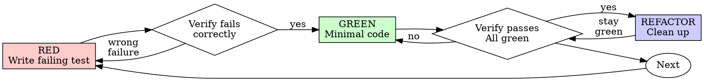

# Test-Driven Development (TDD) for React Native

## Overview

Write the test first. Watch it fail. Write minimal code to pass.

**Core principle:** If you didn't watch the test fail, you don't know if it tests the right thing.

**Violating the letter of the rules is violating the spirit of the rules.**

## Testing Stack

- **Test runner:** Jest (standard for React Native / Expo)
- **Component testing:** `@testing-library/react-native` (React Native Testing Library)
  - `render`, `screen` — render components and query the output
  - `fireEvent`, `userEvent` — simulate user interactions
  - `waitFor`, `findBy*` queries — handle async state updates
  - `renderHook` — test custom hooks in isolation
- **Assertions:** Jest matchers + `@testing-library/jest-native` extended matchers

## When to Use

**Always:**
- New features
- Bug fixes
- Refactoring
- Behavior changes

**Exceptions (ask your human partner):**
- Throwaway prototypes
- Generated code
- Configuration files

Thinking "skip TDD just this once"? Stop. That's rationalization.

## The Iron Law

```
NO PRODUCTION CODE WITHOUT A FAILING TEST FIRST
```

Write code before the test? Delete it. Start over.

**No exceptions:**
- Don't keep it as "reference"
- Don't "adapt" it while writing tests
- Don't look at it
- Delete means delete

Implement fresh from tests. Period.

## Red-Green-Refactor



### RED - Write Failing Test

Write one minimal test showing what should happen.

<Good>
```typescript
test('displays welcome message with user name', () => {
  render(<WelcomeScreen userName="Alice" />);

  expect(screen.getByText('Welcome, Alice!')).toBeOnTheScreen();
});
```
Clear name, tests user-visible behavior, one thing
</Good>

<Bad>
```typescript
test('component works', () => {
  const { root } = render(<WelcomeScreen userName="Alice" />);
  expect(root.props.userName).toBe('Alice');
});
```
Vague name, tests props/internals instead of rendered output
</Bad>

**Requirements:**
- One behavior
- Clear name
- Test what the user sees and interacts with (not implementation details)

### Verify RED - Watch It Fail

**MANDATORY. Never skip.**

```bash
npx jest path/to/component.test.tsx
```

Confirm:
- Test fails (not errors)
- Failure message is expected
- Fails because feature missing (not typos)

**Test passes?** You're testing existing behavior. Fix test.

**Test errors?** Fix error, re-run until it fails correctly.

### GREEN - Minimal Code

Write simplest code to pass the test.

<Good>
```typescript
function WelcomeScreen({ userName }: { userName: string }) {
  return (
    <View>
      <Text>Welcome, {userName}!</Text>
    </View>
  );
}
```
Just enough to pass
</Good>

<Bad>
```typescript
function WelcomeScreen({
  userName,
  theme,
  onDismiss,
  animationConfig,
  analyticsTracker,
}: WelcomeScreenProps) {
  // YAGNI - none of this is tested yet
}
```
Over-engineered
</Bad>

Don't add features, refactor other code, or "improve" beyond the test.

### Verify GREEN - Watch It Pass

**MANDATORY.**

```bash
npx jest path/to/component.test.tsx
```

Confirm:
- Test passes
- Other tests still pass
- Output pristine (no errors, warnings)

**Test fails?** Fix code, not test.

**Other tests fail?** Fix now.

### REFACTOR - Clean Up

After green only:
- Remove duplication
- Improve names
- Extract helpers / shared components

Keep tests green. Don't add behavior.

### Repeat

Next failing test for next feature.

## React Native Testing Patterns

### Testing Component Rendering

```typescript
import { render, screen } from '@testing-library/react-native';

test('shows error message when validation fails', () => {
  render(<LoginForm errors={{ email: 'Invalid email' }} />);

  expect(screen.getByText('Invalid email')).toBeOnTheScreen();
});
```

### Testing User Interactions

```typescript
import { render, screen, userEvent } from '@testing-library/react-native';

test('calls onSubmit with email when button pressed', async () => {
  const user = userEvent.setup();
  const onSubmit = jest.fn();
  render(<LoginForm onSubmit={onSubmit} />);

  await user.type(screen.getByPlaceholderText('Email'), 'alice@example.com');
  await user.press(screen.getByRole('button', { name: 'Sign In' }));

  expect(onSubmit).toHaveBeenCalledWith({ email: 'alice@example.com' });
});
```

### Testing Async Operations

```typescript
import { render, screen, waitFor } from '@testing-library/react-native';

test('displays profile data after loading', async () => {
  render(<ProfileScreen userId="123" />);

  expect(screen.getByText('Loading...')).toBeOnTheScreen();

  // waitFor retries until assertion passes or times out
  await waitFor(() => {
    expect(screen.getByText('Alice Johnson')).toBeOnTheScreen();
  });

  expect(screen.queryByText('Loading...')).not.toBeOnTheScreen();
});

// Or use findBy* queries (built-in waitFor):
test('displays profile data after loading', async () => {
  render(<ProfileScreen userId="123" />);

  const name = await screen.findByText('Alice Johnson');
  expect(name).toBeOnTheScreen();
});
```

### Testing Custom Hooks

```typescript
import { renderHook, waitFor } from '@testing-library/react-native';

test('useCounter increments count', () => {
  const { result } = renderHook(() => useCounter(0));

  expect(result.current.count).toBe(0);

  act(() => {
    result.current.increment();
  });

  expect(result.current.count).toBe(1);
});

test('useFetchUser returns user data', async () => {
  const { result } = renderHook(() => useFetchUser('123'));

  await waitFor(() => {
    expect(result.current.data).toEqual({ id: '123', name: 'Alice' });
  });
});
```

### Testing Navigation (Expo Router)

```typescript
import { render, screen, userEvent } from '@testing-library/react-native';
import { useRouter } from 'expo-router';

jest.mock('expo-router', () => ({
  useRouter: jest.fn(),
}));

test('navigates to details on item press', async () => {
  const push = jest.fn();
  (useRouter as jest.Mock).mockReturnValue({ push });
  const user = userEvent.setup();

  render(<ItemList items={[{ id: '1', title: 'Item 1' }]} />);

  await user.press(screen.getByText('Item 1'));

  expect(push).toHaveBeenCalledWith('/items/1');
});
```

### Testing with Providers (Context, State)

```typescript
function renderWithProviders(ui: React.ReactElement) {
  return render(
    <ThemeProvider>
      <AuthProvider>
        {ui}
      </AuthProvider>
    </ThemeProvider>
  );
}

test('shows logout button when authenticated', () => {
  // Mock auth state or provide test values
  renderWithProviders(<SettingsScreen />);

  expect(screen.getByRole('button', { name: 'Log Out' })).toBeOnTheScreen();
});
```

## Query Priority

Prefer queries that reflect how users find elements:

| Priority | Query | Use For |
|----------|-------|---------|
| 1st | `getByRole` | Buttons, headings, text inputs |
| 2nd | `getByText` | Static text content |
| 3rd | `getByPlaceholderText` | Text inputs |
| 4th | `getByDisplayValue` | Filled inputs |
| 5th | `getByLabelText` | Labeled form elements |
| Last | `getByTestID` | Only when no semantic query works |

`getByTestID` is a last resort. If you reach for it first, rethink your component's accessibility.

## Good Tests

| Quality | Good | Bad |
|---------|------|-----|
| **Minimal** | One thing. "and" in name? Split it. | `test('validates email and domain and whitespace')` |
| **Clear** | Name describes behavior | `test('test1')` |
| **Shows intent** | Demonstrates desired API | Obscures what code should do |
| **User-centric** | Tests what user sees/does | Tests component internals or state |

## Why Order Matters

**"I'll write tests after to verify it works"**

Tests written after code pass immediately. Passing immediately proves nothing:
- Might test wrong thing
- Might test implementation, not behavior
- Might miss edge cases you forgot
- You never saw it catch the bug

Test-first forces you to see the test fail, proving it actually tests something.

**"I already manually tested all the edge cases"**

Manual testing is ad-hoc. You think you tested everything but:
- No record of what you tested
- Can't re-run when code changes
- Easy to forget cases under pressure
- "It worked when I tried it" does not equal comprehensive

Automated tests are systematic. They run the same way every time.

**"Deleting X hours of work is wasteful"**

Sunk cost fallacy. The time is already gone. Your choice now:
- Delete and rewrite with TDD (X more hours, high confidence)
- Keep it and add tests after (30 min, low confidence, likely bugs)

The "waste" is keeping code you can't trust. Working code without real tests is technical debt.

**"TDD is dogmatic, being pragmatic means adapting"**

TDD IS pragmatic:
- Finds bugs before commit (faster than debugging after)
- Prevents regressions (tests catch breaks immediately)
- Documents behavior (tests show how to use code)
- Enables refactoring (change freely, tests catch breaks)

"Pragmatic" shortcuts = debugging in production = slower.

**"Tests after achieve the same goals - it's spirit not ritual"**

No. Tests-after answer "What does this do?" Tests-first answer "What should this do?"

Tests-after are biased by your implementation. You test what you built, not what's required. You verify remembered edge cases, not discovered ones.

Tests-first force edge case discovery before implementing. Tests-after verify you remembered everything (you didn't).

30 minutes of tests after does not equal TDD. You get coverage, lose proof tests work.

## Common Rationalizations

| Excuse | Reality |
|--------|---------|
| "Too simple to test" | Simple code breaks. Test takes 30 seconds. |
| "I'll test after" | Tests passing immediately prove nothing. |
| "Tests after achieve same goals" | Tests-after = "what does this do?" Tests-first = "what should this do?" |
| "Already manually tested" | Ad-hoc does not equal systematic. No record, can't re-run. |
| "Deleting X hours is wasteful" | Sunk cost fallacy. Keeping unverified code is technical debt. |
| "Keep as reference, write tests first" | You'll adapt it. That's testing after. Delete means delete. |
| "Need to explore first" | Fine. Throw away exploration, start with TDD. |
| "Test hard = design unclear" | Listen to test. Hard to test = hard to use. |
| "TDD will slow me down" | TDD faster than debugging. Pragmatic = test-first. |
| "Manual test faster" | Manual doesn't prove edge cases. You'll re-test every change. |
| "Existing code has no tests" | You're improving it. Add tests for existing code. |
| "React Native is hard to test" | React Native Testing Library makes it straightforward. No excuses. |

## Red Flags - STOP and Start Over

- Code before test
- Test after implementation
- Test passes immediately
- Can't explain why test failed
- Tests added "later"
- Rationalizing "just this once"
- "I already manually tested it"
- "Tests after achieve the same purpose"
- "It's about spirit not ritual"
- "Keep as reference" or "adapt existing code"
- "Already spent X hours, deleting is wasteful"
- "TDD is dogmatic, I'm being pragmatic"
- "This is different because..."
- Testing component state directly instead of rendered output
- Reaching for `getByTestID` before trying semantic queries

**All of these mean: Delete code. Start over with TDD.**

## Example: Bug Fix (React Native)

**Bug:** Empty email accepted in login form

**RED**
```typescript
test('shows error when email is empty and submit pressed', async () => {
  const user = userEvent.setup();
  render(<LoginForm />);

  await user.press(screen.getByRole('button', { name: 'Sign In' }));

  expect(screen.getByText('Email required')).toBeOnTheScreen();
});
```

**Verify RED**
```bash
$ npx jest LoginForm.test.tsx
FAIL: Unable to find an element with text: Email required
```

**GREEN**
```typescript
function LoginForm() {
  const [error, setError] = useState('');

  const handleSubmit = (email: string) => {
    if (!email?.trim()) {
      setError('Email required');
      return;
    }
    // ...
  };

  return (
    <View>
      <TextInput placeholder="Email" onChangeText={setEmail} />
      {error ? <Text>{error}</Text> : null}
      <Pressable role="button" accessibilityLabel="Sign In" onPress={() => handleSubmit(email)}>
        <Text>Sign In</Text>
      </Pressable>
    </View>
  );
}
```

**Verify GREEN**
```bash
$ npx jest LoginForm.test.tsx
PASS
```

**REFACTOR**
Extract validation logic, add accessibility labels if missing.

## Verification Checklist

Before marking work complete:

- [ ] Every new function/method/component has a test
- [ ] Watched each test fail before implementing
- [ ] Each test failed for expected reason (feature missing, not typo)
- [ ] Wrote minimal code to pass each test
- [ ] All tests pass
- [ ] Output pristine (no errors, warnings, act() warnings)
- [ ] Tests use real components where possible (mocks only if unavoidable)
- [ ] Tests query by user-visible attributes (role, text, placeholder), not testID
- [ ] Async operations use `waitFor` or `findBy*` (no arbitrary delays)
- [ ] Edge cases and errors covered

Can't check all boxes? You skipped TDD. Start over.

## When Stuck

| Problem | Solution |
|---------|----------|
| Don't know how to test | Write wished-for API. Write assertion first. Ask your human partner. |
| Test too complicated | Design too complicated. Simplify interface. |
| Must mock everything | Code too coupled. Use dependency injection. |
| Test setup huge | Extract render helpers with providers. Still complex? Simplify design. |
| `act()` warnings | Wrap state updates in `act()`, or use `waitFor`/`findBy*` queries. |
| Native module errors | Mock the native module in `jest.setup.js` or per-test. |
| Navigation hard to test | Mock `expo-router` hooks (`useRouter`, `useLocalSearchParams`). |

## Debugging Integration

Bug found? Write failing test reproducing it. Follow TDD cycle. Test proves fix and prevents regression.

Never fix bugs without a test.

## Testing Anti-Patterns

When adding mocks or test utilities, read @testing-anti-patterns.md to avoid common pitfalls:
- Testing mock behavior instead of real behavior
- Adding test-only methods to production classes
- Mocking without understanding dependencies
- Testing implementation details instead of user-visible behavior
- Snapshot testing overuse (prefer behavioral assertions)
- Not using `waitFor` for async state updates

## Final Rule

```
Production code -> test exists and failed first
Otherwise -> not TDD
```

No exceptions without your human partner's permission.
